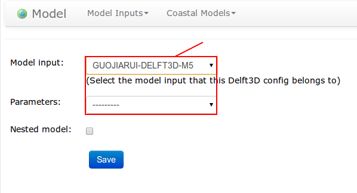

Submit a job step by step
=========================

simulocean workflow
--------------------


.. image:: ../doc/_static/jobworkflow.png
   :align: center
   :height: 500 px
   :width: 800 px

Scgate provides multiple ways to help our user to use simulocean.

1) Magical wand.
Each page on the top right, there is a magical wand; it provides you detailed info of this page.

.. image:: ../doc/_static/magicalwand.png
   :height: 32 px
   :width: 43 px

2) Video tutorial.
Please navigate to this `page`_ to see the video tutorial.

3) Step by step screen shots tutorial.
This page will give you a screen shot tutorial.


4)Post topic on simulocean forum if you have questions or encountered problems.
Please navigate to this `web page`_ to visit our forum.


Handle your job in seven steps
-------------------------------

Since the workflow provided us a big picture of how Scgate works, here are seven steps that can help us run
a general simulocean job.


Create a **project**
``````````````````````
In the first step, you will need to creating a project, Scgate will generate an file management directory for you automatically.

.. image:: ../doc/_static/cproject1.png
   :align: center


Select a **model**
```````````````````
After project creating, you need to chose a model(e.g. Delft3D) for job running. We provide five models so far.

.. image:: ../doc/_static/cmodel1.png
   :height: 290 px
   :width: 598 px
   :align: center



Create a **job**
````````````````````

You can create jobs underneath then.

.. image:: ../doc/_static/cjob1.png
   :height: 150 px
   :width: 667 px
   :align: center


**Insert** your input parameters
`````````````````````````````````
 You can submit your input parameters either by **upload input files** or **fill in input forms**:

.. image:: ../doc/_static/cinput1.png
   :height: 160 px
   :width: 667 px
   :align: center

.. image:: ../doc/_static/cinput2.png
   :height: 260 px
   :width: 667 px
   :align: center


**Submit** your job
````````````````````
Simply submit your job, and your job will be in the waiting list and ready to go.

**Check** status
`````````````````

Check status during the Job running from Scgate control panel. All your jobs are under control.

**Post-process**
````````````````
In this step, we provide output data visualization and comparison. Details please see
**Chapter 5. Data Observation** segment in the directory.


.. _page: http://localhost:8000/about/contact/
.. _web page: http://localhost:8000/about/contact/
